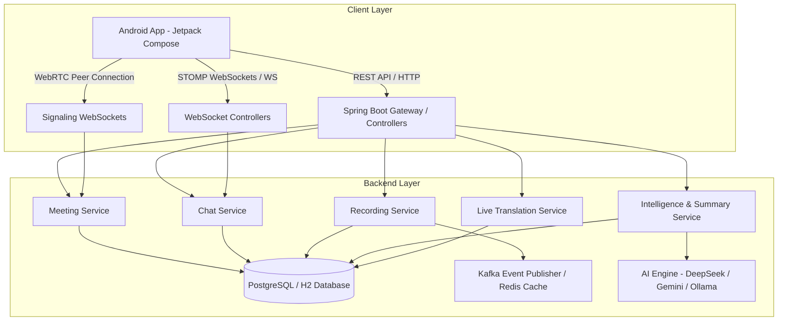
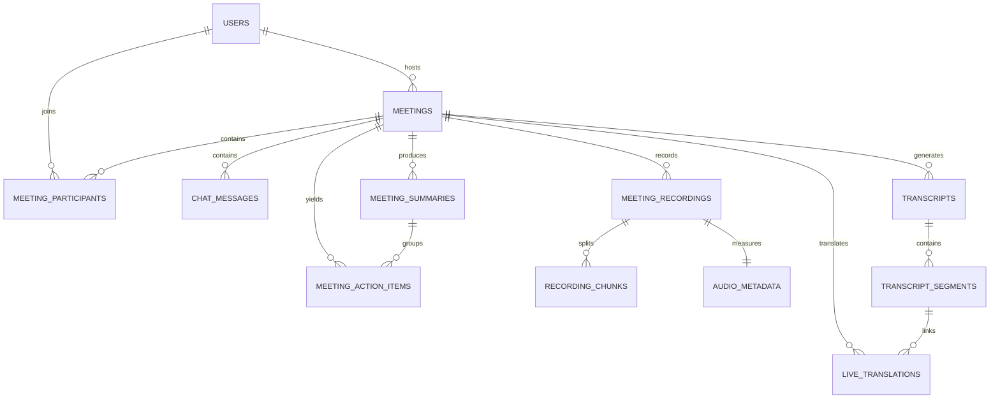

# 🧠 MeetMind AI — Next-Gen AI-Powered Meeting Orchestration & Intelligence Platform

[](https://github.com/rahulambhore394/MeetMind-AI)
[](https://github.com/rahulambhore394/MeetMind-AI)
[](https://github.com/rahulambhore394/MeetMind-AI)
[](https://github.com/rahulambhore394/MeetMind-AI)
[](LICENSE)

**MeetMind AI** is an end-to-end, enterprise-grade meeting intelligence platform designed to eliminate meeting fatigue. It provides **real-time audio & screen recording**, **sub-second STOMP WebSocket chat**, **live multilingual translation**, **autonomous AI representative participation**, and **automated post-meeting summary reports** with individual user action item assignments.

---

## 🌟 Key Features

### 1. 🎙️ Real-Time Live Meeting Recording & Audio-Screen Capture
- Dual-stream real-time recording capturing both high-definition system/microphone audio and live screen sharing streams.
- Intelligent background chunking (`recording_chunks`) into compressed formats ready for real-time AI transcription pipeline ingestion.
- Full participant status tracking (`AUDIO_CHUNKING`, `READY_FOR_TRANSCRIPTION`, `PROCESSING`, `COMPLETED`).

### 2. 💬 Real-Time Live Meeting Chat & Messaging
- Low-latency WebSocket chat powered by STOMP over `/ws-chat` with SockJS fallback.
- Persistent message history per meeting with sender role indicators (Host, Participant, AI Agent).
- Real-time system notifications for participant joins, leaves, and screen sharing events.

### 3. 🤖 Autonomous AI Representative Meetings
- Send an **AI Representative Agent** to attend meetings on your behalf when you cannot join.
- Equipped with custom persona context, knowledge access control, real-time live transcript indexing, and automated Q&A capabilities.
- Dedicated dashboard view to inspect meetings attended by AI Representatives.

### 4. 📄 Comprehensive Post-Meeting Summary Reports & Action Items
- Automated trigger upon meeting conclusion (`MeetingEndedEventListener`) that aggregates transcript segments, chat logs, and recording metadata.
- Generates a structured **Comprehensive Summary Report**:
  - **Overview & Executive Summary**: Concise meeting takeaway.
  - **Individual User Sections**: Dedicated breakdown per participant detailing their contributions and key discussion points.
  - **Action Items & Task Assignment**: Extracted tasks with clear assignees, due dates, confidence scores, and status (`OPEN`, `IN_PROGRESS`, `COMPLETED`, `NEEDS_REVIEW`).
- Dedicated **Meeting Summaries Dashboard** option to browse both standard meetings and AI Representative sessions.

### 5. 🌐 Live Multilingual Translation
- Instant dual-language translation of live transcript segments during meetings.
- Powered by high-speed translation services with local fallback providers.
- Supports cross-language collaboration across global teams.

---

## 🏗️ System Architecture



---

## 🗄️ Database Schema & Entity Relationship

The database schema is designed for high concurrency and relational integrity, supporting full auditability of meetings, participants, transcripts, and intelligence metrics.



### Table Details

| Table Name | Description | Key Attributes |
| :--- | :--- | :--- |
| `users` | User credentials & profiles | `id`, `email`, `full_name`, `avatar_url`, `created_at` |
| `meetings` | Meeting metadata & lifecycle state | `id`, `title`, `host_id`, `status` (SCHEDULED, LIVE, ENDED, CANCELLED), `scheduled_time`, `room_code` |
| `meeting_participants` | Participant attendance & roles | `id`, `meeting_id`, `user_id`, `role` (HOST, PARTICIPANT, AUTOMATED_AGENT), `status` |
| `chat_messages` | Real-time meeting chat logs | `id`, `meeting_id`, `sender_id`, `message_text`, `message_type`, `created_at` |
| `meeting_recordings` | Audio & screen recording sessions | `id`, `meeting_id`, `owner_id`, `started_at`, `ended_at`, `status`, `storage_path` |
| `recording_chunks` | Audio/video stream chunks | `id`, `recording_id`, `chunk_index`, `start_ms`, `end_ms`, `storage_path` |
| `transcripts` | Meeting transcript master record | `id`, `meeting_id`, `status`, `provider_name`, `completed_at` |
| `transcript_segments` | Time-stamped spoken segments | `id`, `transcript_id`, `speaker`, `text`, `start_ms`, `end_ms`, `confidence` |
| `meeting_summaries` | Post-meeting executive summaries | `id`, `meeting_id`, `overview`, `key_takeaways`, `sentiment`, `model_metadata` |
| `meeting_action_items` | Extracted action items & assignees | `id`, `meeting_summary_id`, `meeting_id`, `description`, `assigned_user`, `due_date`, `status` |
| `live_translations` | Real-time translated segments | `id`, `meeting_id`, `transcript_segment_id`, `source_text`, `translated_text`, `target_language` |

---

## 🛠️ Technology Stack

### Android Mobile App
- **Language**: Kotlin 2.0+
- **UI Framework**: Jetpack Compose (Material3 Design System)
- **Architecture**: MVVM + Clean Architecture with Coroutines & Flow
- **Networking**: Retrofit2, OkHttp3, STOMP Protocol Client
- **Media**: Android MediaProjection API, AudioRecord, MediaCodec, TextToSpeech

### Backend Server
- **Framework**: Java 21, Spring Boot 3.4.1
- **Persistence**: Spring Data JPA, Hibernate, Flyway Migrations
- **Database**: H2 (In-Memory Development) / PostgreSQL (Production)
- **Real-Time Communication**: Spring WebSocket (STOMP), SockJS, WebRTC Signaling
- **Messaging & Cache**: Apache Kafka, Redis Cache
- **AI Integrations**: DeepSeek API, Google Gemini API, Local Ollama LLM Engine

---

## 🚀 Getting Started & Local Setup

### 1. Prerequisites
- **JDK**: Java 21 LTS installed and set in `JAVA_HOME`.
- **Android Studio**: Ladybug / Koala or newer with Android SDK 35/37.
- **Maven**: Version 3.8+ (or use included `./mvnw`).

---

### 2. Running the Backend Server
Navigate to `meetmind-backend/` and launch the Spring Boot application:

```bash
cd meetmind-backend
# Set environment variables for H2 PostgreSQL compatibility mode
set SPRING_DATASOURCE_URL=jdbc:h2:mem:meetmind;MODE=PostgreSQL;DATABASE_TO_LOWER=TRUE;DEFAULT_NULL_ORDERING=HIGH
set SPRING_FLYWAY_ENABLED=false
set SPRING_KAFKA_ENABLED=false

# Launch Spring Boot
./mvnw spring-boot:run
```
> The server will start at `http://localhost:8080` (health endpoint: `http://localhost:8080/actuator/health`).

---

### 3. Deploying & Testing on a Physical Android Device

#### Option A: USB Connection (ADB Port Reverse)
1. Connect your Android device via USB and enable **USB Debugging**.
2. Run port forwarding so the device can reach `localhost:8080`:
   ```bash
   adb reverse tcp:8080 tcp:8080
   ```
3. Install and run the debug APK:
   ```bash
   adb install -r android/app/build/outputs/apk/debug/app-debug.apk
   ```

#### Option B: Wi-Fi Local Network
1. Ensure your laptop and physical mobile device are connected to the same Wi-Fi network.
2. Update `debug BASE_URL` in `android/app/build.gradle.kts` with your laptop's Wi-Fi IP address (e.g. `http://10.70.40.176:8080/`).
3. Build & install:
   ```bash
   cd android
   ./gradlew assembleDebug
   adb install -r app/build/outputs/apk/debug/app-debug.apk
   ```

---

## 📝 License

This project is open-source and available under the [MIT License](LICENSE).
